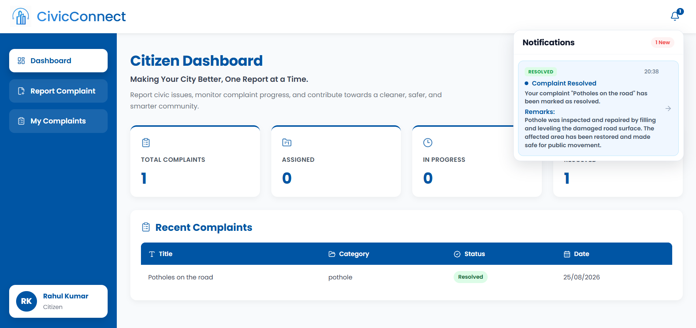
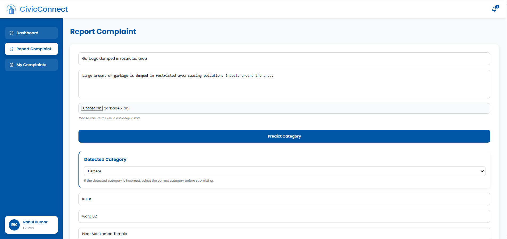
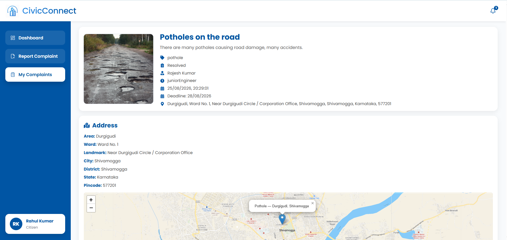
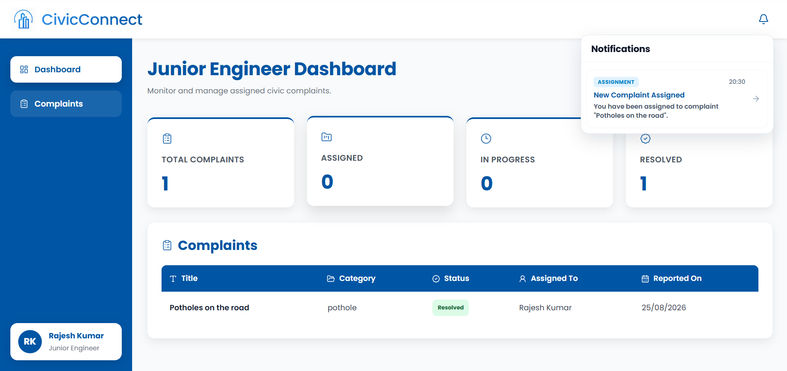
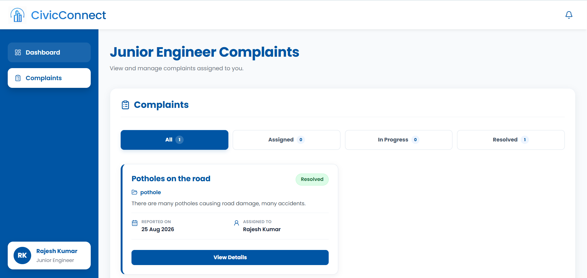
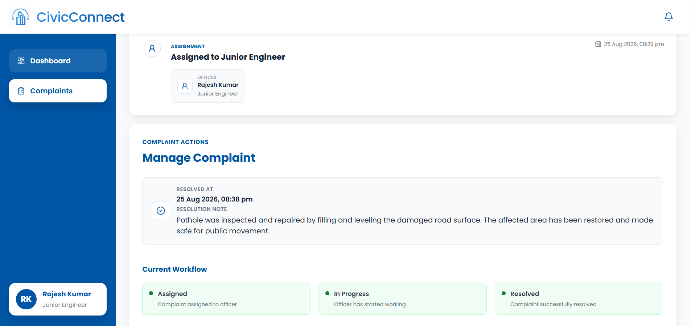
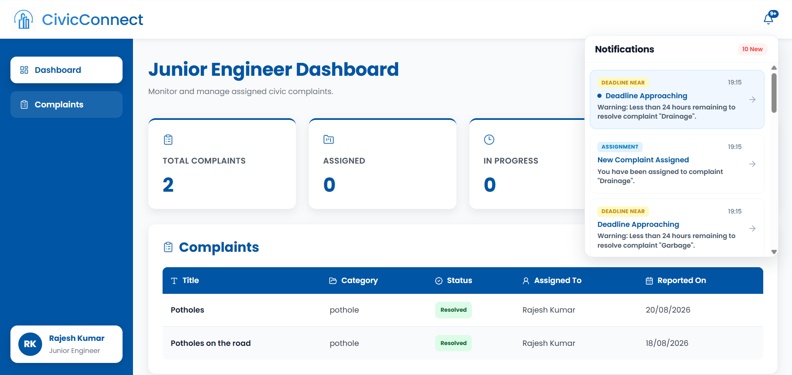
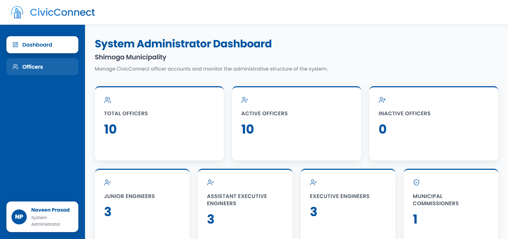
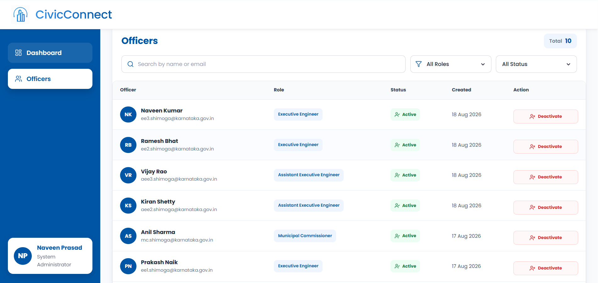
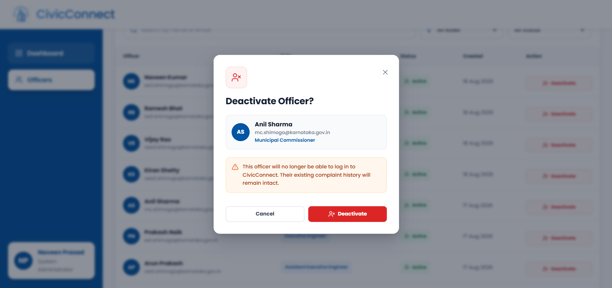

# 📌 CivicConnect

### *Smart Civic Issue Detection, Reporting and Management System*

CivicConnect is a full-stack web application designed to help citizens report common civic issues and enable municipal authorities to manage, assign, monitor, escalate, and resolve complaints through a structured ward-based workflow.

The system combines **Machine Learning-based civic issue detection** with a complete civic complaint management system. Citizens can upload an image of a civic issue, and a fine-tuned **MobileNetV2 model using transfer learning** detects whether the image represents a **pothole, garbage, or drainage issue**.

The detected issue is presented as a suggested category during the complaint reporting process, allowing the citizen to review and change the category if the prediction is incorrect. The complaint is then associated with a municipality and ward and assigned to an eligible municipal officer.

CivicConnect also includes workload-aware officer assignment, deadline-based automatic escalation, controlled manual escalation, workflow alerts, complaint history, location visualization, Google Maps navigation, complaint resolution, and System Administrator management of municipal officers.

---

## ✨ Features

### 🔐 Authentication

- Citizen registration and login
- JWT-based authentication
- Protected routes
- Role-based access control
- Separate access for citizens, municipal officers, and System Administrators

---

### 🤖 Machine Learning-Based Civic Issue Detection

CivicConnect uses Machine Learning to identify the type of civic issue from an uploaded image.

The image classification model is built using:

- **MobileNetV2**
- Transfer Learning
- Fine-Tuning
- Image Classification

The model is trained to recognize three civic issue categories:

- Potholes
- Garbage
- Drainage

The detection workflow is:

```text
Civic Issue Image
        ↓
Image Preprocessing
        ↓
MobileNetV2
        ↓
Transfer Learning
        ↓
Fine-Tuning
        ↓
Civic Issue Prediction
        ↓
Pothole / Garbage / Drainage
```

The trained model is used by the ML service to process uploaded civic issue images and return the predicted category.

The Machine Learning component was trained using Google Colab and the resulting fine-tuned model is integrated into the project for civic issue classification.

The predicted category is presented to the citizen as a suggested category. The citizen can review the prediction and change the category if the prediction is incorrect before submitting the complaint.

This allows the system to combine image-based Machine Learning classification with user verification as part of the complaint reporting process.

---

### 📝 Civic Complaint Reporting

Citizens can report civic issues through a structured complaint form.

A complaint can include:

- Complaint title
- Description
- Civic issue category
- Municipality
- Ward number
- Address details
- Civic issue image
- Complaint location

The uploaded image can be analyzed by the Machine Learning model to identify the civic issue category.

The predicted category is shown to the citizen and can be changed before the complaint is submitted.

The complaint is then processed through the municipality and ward-based assignment workflow.

---

### 📍 Location and Address Handling

CivicConnect supports location-based complaint reporting.

Citizens can:

- Use their current location
- Obtain geographic coordinates
- Retrieve location information from the detected location
- Enter address details manually
- Select from supported municipality and ward combinations

For manually entered addresses, the backend can use forward geocoding to obtain coordinates for map visualization.

The system uses controlled municipality and ward combinations rather than allowing arbitrary municipality and ward selections.

---

### 🗺️ Interactive Maps

CivicConnect uses Leaflet and MapTiler to display complaint locations.

Citizens can view:

- Complaint location
- Location marker
- Map popup

Officers can view:

- Complaint location
- Location marker
- Map popup
- Navigation option

The Navigate to Site option opens the complaint coordinates in Google Maps, helping officers reach the reported location.

---

### 👤 Citizen Module

The citizen module allows users to report and monitor their complaints.

Citizens can:

- Register and log in
- Submit civic complaints
- Upload civic issue images
- Get Machine Learning-based issue detection
- Select municipality and ward
- Provide address information
- Use current location
- View complaint locations on a map
- Track complaint status
- View assigned officer information
- View the current officer level
- View complaint deadlines
- View assignment history
- View escalation history
- View resolution information
- View complaint support count
- Receive resolution alerts

---

### 👷 Officer Module

CivicConnect supports multiple levels of municipal officers:

- Junior Engineer (JE)
- Assistant Executive Engineer (AEE)
- Executive Engineer (EE)
- Municipal Commissioner (MC)

Officers receive complaints according to their municipality, ward, role, and active status.

Officers can:

- Access their role-specific dashboard
- View assigned complaints
- View complaint details
- View complaint images
- View complaint address
- View complaint location on an interactive map
- Navigate to the complaint site using Google Maps
- Update complaint status
- Resolve complaints
- Add resolution notes
- View assignment history
- View escalation history
- Receive workflow alerts
- Mark alerts as read

---

### 🏛️ System Administrator Module

The System Administrator manages officer activation status across municipalities and wards.

The System Administrator can:

- View a municipality dashboard showing total, active, and inactive officer counts, broken down by role (JE, AEE, EE, MC)
- Activate officers
- Deactivate officers
- Manage officer active/inactive status

Deactivation is only allowed if at least one other active officer exists at the same officer level, for the same municipality and ward. This prevents a municipality/ward from being left without the required active officer coverage at that level.

---

### 🏢 Government Employee Registry

CivicConnect maintains a Government Employee Registry for municipal complaint handling.

The registry contains employee information such as:

- Employee ID
- Name
- Email
- Role
- Municipality
- Ward assignment
- Active status

The registry includes:

- Junior Engineers
- Assistant Executive Engineers
- Executive Engineers
- Municipal Commissioners
- System Administrators

The current registry covers three municipalities:

- Shimoga
- Davangere
- Bhadravathi

Each municipality currently contains:

- Ward 1
- Ward 2
- Ward 3

For each municipality:

- Three officers are available for each operational officer role per ward
- One Municipal Commissioner is maintained
- One System Administrator is maintained

The registry is used by the complaint assignment and escalation workflow to identify eligible officers.

---

### 📌 Ward-Based Complaint Assignment

Complaints are routed according to:

- Municipality
- Ward number
- Officer role
- Officer active status
- Current complaint workload

New complaints are initially assigned to a Junior Engineer belonging to the corresponding municipality and ward.

Only active officers are considered for assignment.

When multiple eligible officers are available, the system considers their existing active complaint workload while selecting an officer.

The basic assignment workflow is:

```text
Complaint
    ↓
Municipality
    ↓
Ward
    ↓
Eligible Active Officers
    ↓
Workload Consideration
    ↓
Junior Engineer Assignment
```

This prevents complaints from being assigned to inactive officers and helps distribute active complaints among eligible officers.

---

### ⏳ Complaint Escalation

CivicConnect supports both automatic and manual escalation.

The officer hierarchy used for escalation is:

```text
Junior Engineer
        ↓
Assistant Executive Engineer
        ↓
Executive Engineer
```

The Municipal Commissioner is the highest administrative level in the system.

---

### ⚙️ Automatic Escalation

Automatic escalation occurs when the complaint deadline is reached while the complaint is still active and unresolved.

The escalation process moves the complaint to the next appropriate officer level.

```text
JE
 ↓
Deadline Reached
 ↓
AEE
 ↓
Deadline Reached
 ↓
EE
```

The system prevents automatic escalation beyond the configured final officer level.

Automatic escalation is handled by the backend escalation workflow.

---

### 🔄 Manual Escalation

Manual escalation is available to:

- Junior Engineers
- Assistant Executive Engineers

Manual escalation requires:

- A predefined valid escalation reason
- An optional escalation note
- The officer must currently be assigned to the complaint
- The officer's role must match the complaint's current level
- The complaint must still be active
- The complaint deadline must not have been reached

Manual escalation is blocked after the deadline because the system handles escalation automatically at that point.

The backend validates the escalation conditions and prevents invalid manual escalation requests.

---

### 🚨 Alerts and Notifications

CivicConnect provides workflow alerts for important complaint events.

#### Officer Alerts

- **Assignment Alert** — generated when a complaint is assigned to an officer
- **Manual Escalation Alert** — generated when a complaint is manually escalated to the next officer level
- **Automatic Escalation Alert** — generated when a complaint is automatically escalated
- **Deadline-Near Alert** — generated when the complaint deadline is approaching
- **Overdue Alert** — generated when a complaint becomes overdue
- **Administrative Attention Alert** — generated for the Municipal Commissioner when administrative attention is required after the configured period

Officers can view their alerts and mark them as read.

#### Citizen Alerts

- **Resolved Alert** — generated when a complaint is resolved by an officer

---

### ✅ Complaint Resolution

Assigned officers can resolve complaints by updating the complaint with a resolution note.

After a complaint is resolved:

- The complaint is marked as resolved
- Resolution information becomes available to the citizen
- A resolved alert is sent to the citizen
- The complaint is no longer treated as an active complaint
- It is no longer included in active complaint workload calculations

---

### 📚 Complaint History

CivicConnect maintains the history of a complaint throughout its workflow.

#### Assignment History

Assignment history records:

- Assigned officer
- Officer level
- Assignment information
- Assignment changes during the complaint lifecycle

#### Escalation History

Escalation history records:

- Previous officer level
- New officer level
- Escalation reason
- Escalation note
- Escalation time
- Escalation type

Escalations are identified as:

- Manual
- Automatic

This provides a traceable record of how a complaint moved through the municipal workflow.

---

### 🏷️ Supported Civic Issue Categories

The current Machine Learning model and complaint workflow support three major civic issue categories:

- **Potholes**
- **Garbage**
- **Drainage**

The system intentionally focuses on these categories in the current implementation to maintain a clear and structured detection and complaint workflow.

Additional civic issue categories can be incorporated in future versions.

---

# 🛠 Tech Stack

### Frontend

- React.js
- React Router
- Axios
- React Icons
- Lucide React
- React Leaflet
- Leaflet
- CSS3

### Backend

- Node.js
- Express.js
- Mongoose
- JWT Authentication

### Database

- MongoDB
- Mongoose

### Machine Learning

- Python
- TensorFlow
- Keras
- MobileNetV2
- Transfer Learning
- Fine-Tuning
- Image Classification

### Maps and Location

- Leaflet
- React Leaflet
- MapTiler
- Google Maps navigation
- Geolocation
- Geocoding

### Development Tools

- Google Colab
- Git
- GitHub
- Git Bash

---

# 📁 Project Structure

```text
CivicConnect/

├── backend/
├── frontend/
├── ml-service/
├── screenshots/
├── .gitignore
└── README.md
```

---

# 🔄 Overall System Workflow

The complete CivicConnect workflow combines Machine Learning, complaint reporting, ward-based assignment, officer management, escalation, and resolution.

```text
Citizen
   │
   │ Upload Civic Issue Image
   ▼
Machine Learning Model
   │
   │ MobileNetV2
   │ Transfer Learning
   │ Fine-Tuning
   ▼
Issue Detection
   │
   ├── Pothole
   ├── Garbage
   └── Drainage
   │
   ▼
Citizen Reviews / Changes Category
   │
   ▼
Complaint Submission
   │
   ├── Municipality
   ├── Ward
   ├── Address
   └── Location
   │
   ▼
Ward-Based Assignment
   │
   ▼
Junior Engineer
   │
   ├──────────────► Resolve
   │
   │ Manual Escalation
   │       OR
   │ Deadline Reached
   ▼
Assistant Executive Engineer
   │
   ├──────────────► Resolve
   │
   │ Manual Escalation
   │       OR
   │ Deadline Reached
   ▼
Executive Engineer
   │
   └──────────────► Resolve
   │
   ▼
Citizen Receives Resolution Update
```

---

# 💡 What Makes CivicConnect Different?

Many civic complaint systems focus primarily on allowing citizens to submit complaints and track their status.

CivicConnect combines image-based civic issue detection with a structured municipal complaint workflow.

The system connects multiple stages:

```text
Civic Issue Image
        ↓
Machine Learning Detection
        ↓
Citizen Review / Category Selection
        ↓
Complaint Reporting
        ↓
Municipality & Ward Selection
        ↓
Officer Assignment
        ↓
Complaint Monitoring
        ↓
Escalation
        ↓
Resolution
```

The project focuses on making the complaint lifecycle more structured by combining Machine Learning-based classification with ward-based officer assignment, workload consideration, escalation handling, alerts, location visualization, and resolution tracking.

---

# 🚀 Future Improvements

- Support for additional civic issue categories
- Real-time communication between citizens and municipal authorities
- More detailed municipal analytics and reports
- Mobile application
- Improved Machine Learning models with larger and more diverse datasets
- Continuous model improvement using additional civic issue images
- Advanced complaint trend and ward-level analytics
- Integration with additional municipal services

---

# 📸 Screenshots

### Citizen Dashboard



---

### Complaint Report



---

### Citizen Complaint Details



---

### Officer Dashboard



---

### Officer Complaints Page



---

### Officer Actions



---

### Officer Notification



---

### System Administrator Dashboard



---

### Officer List



---

### System Administrator Action



---

# 🎥 Project Demo

Complete module demonstrations are available through Google Drive.

### Citizen Module Demo

🔗 **Demo Video:** [Citizen Module Demo](https://drive.google.com/file/d/1pbDgEBaT3P8xZQnopDPqcGVW8h922tgY/view?usp=sharing)

### Officer Module Demo

🔗 **Demo Video:** [Officer Module Demo](https://drive.google.com/file/d/18C5QtOmu4Nn7YJHfTJjW6v_r9Jmv1_C_/view?usp=sharing)

### System Administrator Module Demo

🔗 **Demo Video:** [System Administrator Module Demo](https://drive.google.com/file/d/1Z-BSmD9vIA8FVxtwUR_F78cYbzMNlD3f/view?usp=sharing)

---

# 👩‍💻 Developed By

**Mary Sophia R**

Aspiring Software Engineer | AI & ML Engineering Student

---

*"From civic issue detection to resolution — making complaint management more structured and accountable."*